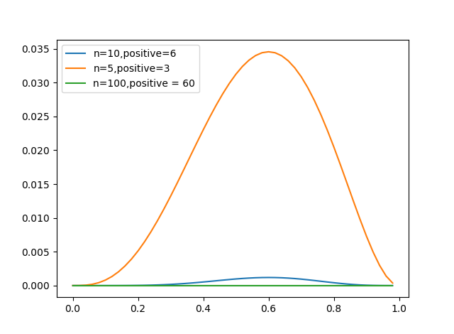

# problem 2

1.  

$$
\begin{aligned}
L(\theta) &= \prod \theta^{X_i}(1- \theta) ^{1-X_i}\\
&= \theta^{\sum X_i}(1-\theta)^{n-\sum X_i}
\end{aligned}
$$

2.  

    [code](./hw2.py)

    

3.  

$$
\begin{aligned}
Ln\ L(\theta) &= ln\ \theta\sum X_i +(n - \sum X_i)ln(1-\theta)\\
\frac{\partial Ln\ L(\theta)}{\partial \theta} &= \frac{\sum X_i}{\theta} + -1\frac{n - \sum X_i}{1 - \theta}  = 0\\
\theta& = \frac{\sum X_i}{\theta} = 0.6
\end{aligned}
$$

4.  
   
   

# problem 3

**note**:

问题3 告诉我们， MLE 与MAP 准则，在数据量很大的情况下，趋近于相等

# problem 4

**note:**

问题4 告诉我们 为什么分割决策树的时候不用错误率,并且用了一个实际的数据集告诉我们 ID3 比 错误率更加好，对于题目中的数据集来说，一个叶子节点是最好的分割方式，错误率更好，然而对于entrop 来说 还能够继续分割

